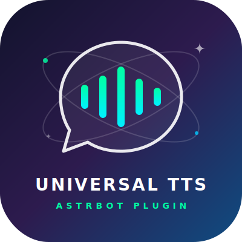

<div align="center">



# Universal TTS / 通用 TTS

**让每一条消息都能听见**

[](https://github.com/AstrBotDevs/AstrBot)
[](LICENSE)
[]()

一个为 [AstrBot](https://github.com/AstrBotDevs/AstrBot) 打造的通用语音合成插件。
支持多种引擎，覆盖国内外主流 TTS 服务，还能自定义接入任意 HTTP API。

</div>

---

## ✨ 亮点

- 🎯 **即插即用** — 自动接管 AstrBot TTS 管道，零配置冲突
- 🔄 **热切换** — 运行时可一条指令切换引擎，无需手动进入后台重启
- 🌍 **多引擎覆盖** — MiMo · OpenAI · 火山引擎 · 阿里云 · Azure · ElevenLabs
- 🛠️ **万能适配** — 自定义 HTTP 引擎，模板化接入任何 TTS API
- 🎨 **WebUI 配置** — 所有参数可视化，所见即所得

---

## 📦 支持的引擎

| 提供商 | 引擎 | 特点 |
|--------|------|------|
| **MiMo** | V2-TTS | 预置音色 + `<style>` 标签风格控制 |
| **MiMo** | V2.5-TTS | 精品音色 + 自然语言风格控制 |
| **MiMo** | V2.5-VoiceDesign | 文本描述生成音色 |
| **MiMo** | V2.5-VoiceClone | 音频样本克隆任意音色 |
| **OpenAI** | 兼容 TTS | `/v1/audio/speech` 标准接口 |
| **火山引擎** | SAMI TTS | 字节跳动，丰富发音人 |
| **阿里云百炼** | CosyVoice | DashScope 兼容接口 |
| **Azure** | Cognitive Services | SSML + 情感风格 + 角色扮演 |
| **ElevenLabs** | Text-to-Speech | 多语言高保真语音 |
| **自定义** | HTTP TTS | 模板化接入任意 API |

---

## 🚀 安装

在 AstrBot 管理面板 → 插件市场，通过仓库地址安装：

```
https://github.com/CyrilPeng/astrbot_plugin_universal_tts
```

## ⚙️ 配置

1. 进入插件配置页
2. 点击「TTS 引擎配置列表」添加引擎（按 `[提供商]` 分组）
3. 填写 API Key 和参数
4. 确保 AstrBot 的 TTS 功能已开启

> 💡 引擎列表中第一个为默认引擎，也可通过「当前生效的引擎实例名称」指定。

---

## 🎮 指令

所有指令必须以 `/` 开头。

| 指令 | 说明 |
|------|------|
| `/tts_test [文本]` | 测试当前会话引擎的合成效果 |
| `/tts_engines` | 列出所有已配置引擎（标注全局/本会话状态） |
| `/tts_bind <序号>` | 为当前群聊/私聊绑定专属引擎 |
| `/tts_unbind` | 解除当前会话的绑定，回退全局 |
| `/tts_switch <序号>` | 切换全局默认引擎（管理员） |
| `/tts_bindings` | 查看全局引擎及所有会话绑定（管理员） |
| `/tts_unbind_all` | 清除所有会话绑定（管理员） |

---

## 🔀 会话级引擎绑定

不同群聊、私聊可以使用不同的 TTS 引擎，互不干扰。

- 在某个群里输入 `/tts_bind 2`，该群就会使用第 2 个引擎
- 其他群和私聊不受影响，继续使用全局默认
- 输入 `/tts_unbind` 可解除绑定，回退全局
- 绑定关系持久化存储，重启不丢失

---

## 🛠️ 自定义 HTTP 引擎

不在预置列表里的 TTS 服务？用模板化配置搞定。

### 占位符

| 占位符 | 含义 |
|--------|------|
| `${TEXT}` | 待合成文本 |
| `${API_KEY}` | 你配置的密钥 |
| `${VOICE_SAMPLE_BASE64}` | 音色样本 base64（含 data URI） |
| `${VOICE_SAMPLE_BASE64_RAW}` | 音色样本纯 base64 |
| `${VOICE_SAMPLE_PATH}` | 音色样本文件路径 |

### 示例：接入返回二进制音频的 API

```
URL:      https://api.example.com/v1/tts
Method:   POST
Headers:  Authorization: Bearer ${API_KEY}
Body:     {"text": "${TEXT}", "voice": "alloy"}
响应类型:  binary
音频格式:  mp3
```

### 示例：接入返回 JSON + base64 的 API

```
URL:      https://api.example.com/v1/chat/completions
Method:   POST
Headers:  api-key: ${API_KEY}
Body:     {"model": "tts", "messages": [{"role": "assistant", "content": "${TEXT}"}]}
响应类型:  json
音频路径:  choices.0.message.audio.data
音频编码:  base64
音频格式:  wav
```

---

## 🧩 开发者：扩展新引擎

```
engines/
├── your_provider/
│   ├── __init__.py      # 导出引擎类
│   └── engine.py        # 继承 TTSEngine，实现 synthesize()
└── __init__.py           # 在 ENGINE_REGISTRY 中注册
```

三步完成：
1. 新建 `engines/your_provider/`，实现 `synthesize(text) -> (bytes, format)`
2. 在 `engines/__init__.py` 中导入并注册
3. 在 `_conf_schema.json` 中添加配置模板

---

## 📄 许可证

本项目基于 [AGPL-3.0](LICENSE) 协议开源。

---

<div align="center">

**Made with ❤️ for AstrBot**

</div>
